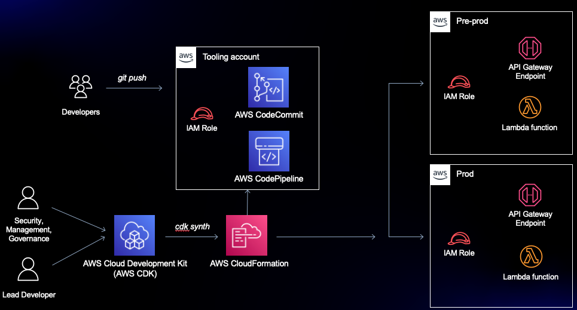
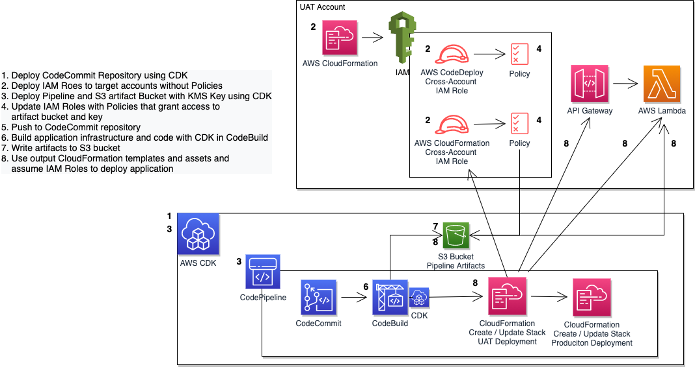
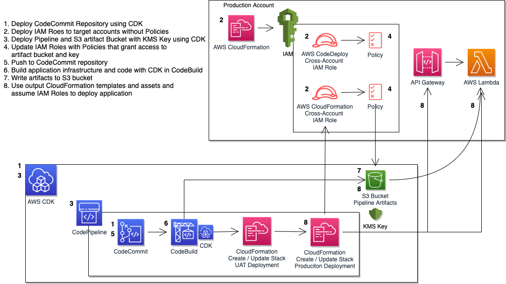

# re:Invent 2021 DOP402 - Automating Cross-Account CI/CD Pipelines

When building a deployment strategy for your applications, using a multi-account approach is a recommended best practice. This limits the impact for changes made and results in better modularity, security, and governance. In this session, we will dive deep into an example multi-account deployment using infrastructure-as-code (IaC) services such as the AWS CDK, AWS CodePipeline, and AWS CloudFormation. We will also explore a real-world customer use case that is deploying at scale across hundreds of AWS accounts.

View the recording of the session including the live demo on YouTube: https://m.youtube.com/watch?v=AF-pSRSGNks

**NOTE: This repository was upgraded to CDK v2 August 22, 2023.**



The solution consists of:
- 2 bash scripts to automate deployment and cleanup, respectively
- 2 CloudFormation templates for the prerequisite roles that need to be deployed to the target accounts
- 3 CDK stacks to define:
  - Repository (kept separate for the pipeline so one could re-deploy or start over with the Pipeline without losing the code)
  - Application (API Gateway backed by a simple "Hello Lambda" function)
  - Pipeline that deploys the Application to the target accounts

The pipeline uses the aforementioned AWS CodeCommit repository as its source, AWS CodeBuild to package the source code for a sample Lambda and to build a CloudFormation template for our application, and a CloudFormation Create/Update Stack Action to deploy each stage of the sample application. You could update the Application to be anything you like - make sure you update the CloudFormation cross-account role actions and resources. It doesn't matter what application is being deployed, the goal is to understand the dependencies on the roles, resources, and pipelines involved in cross-account deployments. 

The pipeline is provisioned in a tooling account, and deploys the sample application into UAT and Production accounts. This means you need a total of 3 accounts to successfully run this solution. 

We'll use AWS CloudFormation templates to deploy the prerequisite cross-account roles for the tooling account to use, and the AWS CDK to deploy the pipeline.





## Deploy

Prerequisites:
- Install and configure git
- Clone repo locally using git
- Set up .aws/credentials profiles for pipeline, uat, and prod so you can execute CLI and CDK commands against them
- Set TOOLS_ACCOUNT_ID, UAT_ACCOUNT_ID, and PROD_ACCOUNT_ID env variables so they can be used by the scripts
- Install npm and the AWS CDK
- Bootstrap the CDK against the Tools account (you do not need to bootstrap the CDK against the target accounts since the pipeline uses the CloudFormation templates '
generated by the CDK - not the CDK itself - to deploy the application)

Run the following command in the root directory of the project:

```bash
./scripts/automate_deployment.sh
```

This script will:
- Verify that you have set the prerequisite environment variables
- Deploy the CDK Repository Stack
- Create the UAT and Production cross-account roles using CloudFormation templates
- Deploy the CDK Pipeline Stack (output: KMS key ARN)
- Update the UAT and Production roles with policies referencing the S3 bucket and KMS key created in the previous step
- Push the initial code base to the new repository, which will start the pipeline execution to ensure a successful application deployment to both UAT and Production. 

Note that the roles are deployed twice. This is because there is a circular dependency on the roles in the target accounts and the pipeline artifact resources provisioned by the CDK. The pipeline needs to reference and resolve the ARNs of the roles it needs to assume to deploy the application to the target accounts, so the roles need to be deployed before the
pipeline is provisioned. However, the policies attached to the roles need to include the S3 bucket and KMS key to read and write encrypted artifacts from and to the pipeline artifact bucket. But the S3 bucket and KMS key don't exist until the CDK application deploys. So, we deploy the roles twice, once without a policy so their ARNs resolve, and a second time to attach policies to the existing roles that reference the CDK resources. The mechanism to trigger whether the policy should be deployed is a CloudFormation Condition on the KMS `KeyArn` parameter passed into the CloudFormation deploy action. 

# Clean Up

Run the following command in the root directory of the project:

```bash
./scripts/automate_cleanup.sh
```

This script will:
- Verify that you have set the prerequisite environment variables
- Destroy the UAT and Production application deployments
- Empty the Pipeline Stack's artifact S3 bucket
- Destroy the Pipeline Stack
- Destroy the UAT and Production cross-account roles

# Troubleshooting
If your account permissions aren't set up correctly, or if you stop a deployment or cleanup mid-way through, you may have to manually clean up deployed resources. Navigate to the CloudFormation console, select the stack that needs to be cleaned up, and click the Delete button to delete the stack manually and start over.

## License

This library is licensed under the MIT-0 License. See the LICENSE file.
